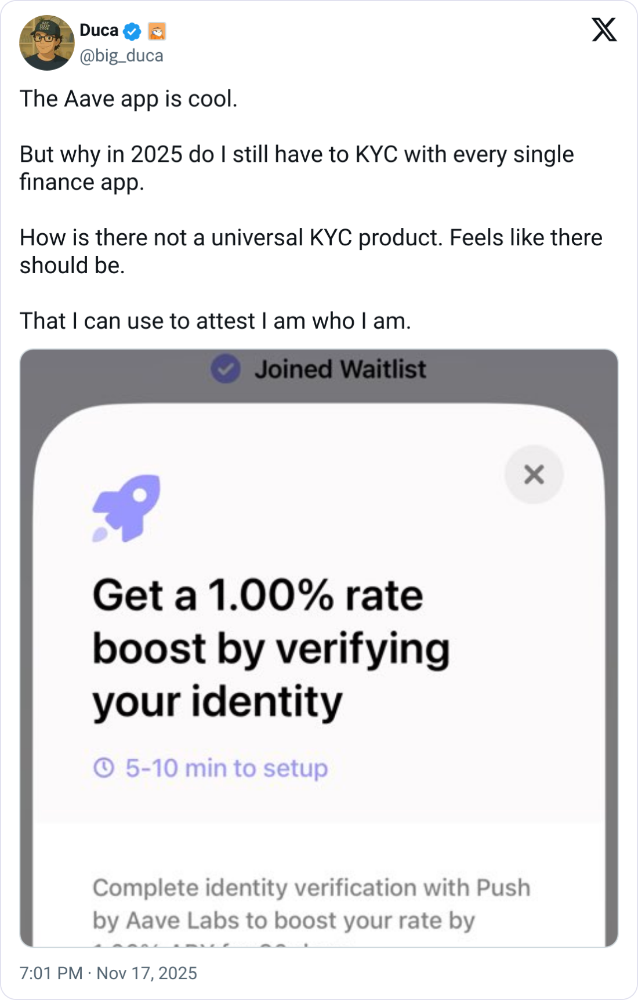
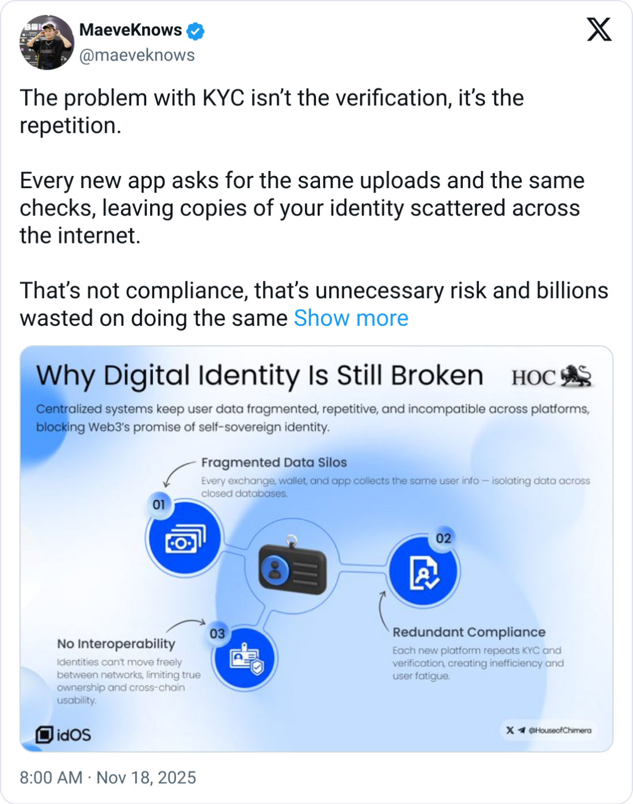

# Credentia KYC: Identity on Rayls

A modular, institutional-grade KYC compliance platform built for the Rayls Network. Credentia enables zero-knowledge proof verification using Reclaim Protocol with **zkTLS proofs** running in the background, and issues NFT-based credentials, creating a privacy-preserving, blockchain-native identity verification system. For institutional grade KYC, we offer a Tier 2 verification assistance.

<table>
  <tr>
    <td width="50%">
      
    </td>
    <td width="50%">
      
    </td>
  </tr>
</table>

## What We're Building

Credentia is a comprehensive KYC (Know Your Customer) platform that bridges traditional identity verification with Web3 infrastructure. The platform provides:

- **Zero-Knowledge Verification with zkTLS**: Users verify their identity using Reclaim Protocol with zkTLS (Zero-Knowledge Transport Layer Security) proofs running seamlessly in the background, ensuring cryptographic privacy without exposing sensitive personal data
- **NFT-Based Credentials**: Successful verifications result in on-chain NFT credentials that serve as proof of KYC status
- **Multi-Tier System**: Supports both individual (Tier 1) and institutional (Tier 2) KYC workflows with verified tenants such as major banks
- **Privacy-First Approach**: Leverages zero-knowledge proofs and zkTLS to maintain user privacy while meeting compliance requirements
- **Blockchain Integration**: Built on Rayls Network testnet with smart contract integration for credential management
- **Streamlined User Experience**: Major UI/UX improvements reduce user overhead and eliminate repetitive document requirements, accelerating growth and making the verification experience much more pleasant

## Product Statement

Credentia is a **modular KYC platform framework** designed for institutional-grade compliance. It enables organizations to verify customer identities using zero-knowledge proofs powered by zkTLS, issue verifiable NFT credentials, and implement KYC-gated services—all while preserving user privacy and meeting regulatory requirements.

**Key Innovations:**
- **zkTLS Proofs**: Advanced zero-knowledge proofs running transparently in the background, providing cryptographic guarantees without user friction
- **Tier 2 Verification**: Institutional-grade verification through verified tenants including major banks (Deutsche Bank, J.P. Morgan, DBS Bank, and more), enabling enterprise-level compliance workflows
- **Reduced Friction**: Smart document reuse and streamlined workflows eliminate repetitive document uploads, significantly reducing user overhead and accelerating onboarding
- **Enhanced UX**: Modern, intuitive interface designed to make KYC verification a pleasant experience rather than a compliance burden

## Key Features

### 🔐 Dynamic Wallet Integration
Seamless wallet connection with Dynamic, enabling users to interact with the platform using their preferred Web3 wallet.

### ✅ KYC Verification
Verify identity using Reclaim Protocol with **zkTLS proofs** running in the background, ensuring cryptographic privacy and security. Support for multiple verification providers:
- **Coinbase KYC** - Verify using Coinbase credentials
- **Binance KYC** - Verify using Binance credentials
- **Tier 2 Institutional Verification** - Enterprise-grade verification through verified tenants including major banks (Deutsche Bank, J.P. Morgan, DBS Bank)
- Extensible architecture for additional verification methods

### 🏛️ Tier 2 Verification with Verified Tenants
Institutional-grade KYC workflows through trusted banking partners:
- **Verified Tenant Network**: Partner with major banks and financial institutions for compliance-grade verification
- **Encrypted Document Storage**: Upload government documents once, securely encrypted and shared with approved tenants
- **Liveliness Checks**: Built-in biometric verification with selfie capture
- **Streamlined Workflows**: Documents uploaded once can be reused across multiple tenant requests, eliminating repetitive uploads
- **Portable Credentials**: Banks issue Tier 2 NFTs upon approval, keeping credentials portable across the ecosystem

### 🎫 NFT Credentials
Upon successful verification, users receive NFT credentials on-chain that serve as proof of their KYC status. These credentials can be used across the ecosystem for KYC-gated services.

### 💎 3D NFT Display
Beautiful passport-style NFT cards with glow effects, providing an intuitive visual representation of verified credentials.

### 🏦 KYC-Gated Services
Demo vault implementation that requires KYC NFT ownership for deposits, demonstrating how credentials can gate access to services.

### 🎨 Modern UI & Enhanced UX
Built with Shadcn UI components and Tailwind CSS, featuring major improvements to reduce user overhead:
- **Smart Document Reuse**: Upload documents once, reuse across multiple verification requests—no more repetitive uploads
- **Streamlined Workflows**: Intuitive interface that guides users through verification with minimal friction
- **Progress Tracking**: Clear visual feedback throughout the verification process
- **Mobile-First Design**: Optimized for all devices with responsive layouts
- **Accelerated Onboarding**: Reduced verification time through intelligent document management and workflow optimization

## Architecture

### Frontend
- **Framework**: Next.js 14 (App Router)
- **Language**: TypeScript
- **Styling**: Tailwind CSS
- **UI Components**: Shadcn UI
- **Wallet**: Dynamic Wallet
- **Web3**: Wagmi + Viem
- **Animations**: Framer Motion

### Backend
- Python-based API server
- Reclaim Protocol integration with zkTLS proof generation
- Smart contract interaction layer
- Encrypted document storage and management

### Smart Contracts
- **KYCNFT**: NFT contract for credential issuance
- **KYCPool**: Pool contract for managing KYC credentials
- **KYCVerifier**: Verification logic contract

### Blockchain
- **Network**: Rayls Network Testnet
- **Standards**: ERC-721 for NFT credentials

## Use Cases

1. **DeFi Platforms**: Require KYC verification before allowing users to access certain features or deposit funds, with zkTLS proofs ensuring privacy
2. **Institutional Services**: Enable partner banks and institutions (Deutsche Bank, J.P. Morgan, DBS Bank, etc.) to verify customers through Tier 2 workflows with encrypted document sharing
3. **Compliance**: Meet regulatory requirements while maintaining user privacy through zero-knowledge proofs and zkTLS
4. **Cross-Platform Identity**: Use NFT credentials across multiple platforms and services without re-verification
5. **Enterprise Onboarding**: Streamlined onboarding for institutions with reduced document repetition and enhanced user experience
6. **Global Expansion**: Accelerate user growth with pleasant, frictionless verification experiences that eliminate repetitive requirements

## Project Structure

```
credentia-kyc/
├── frontend/          # Frontend repo
├── backend/          # Backend repo
└── contracts/        # Contracts repo
```

## Contract Addresses
Claims Library: 0x53874E51378B7d1491D8eEc4B5b9c37528cf17Ae

Reclaim Contract: 0x3745eF8865a1a14ca26089720fEaEE9E595d3521

KYCNFT Contract: 0x71619d009F56087cA07D88443984d4B71c7f2313

KYCVerifier Contract: 0x36e2bd0203523032824f203aBbA1e666998bfFB6

KYCPool Contract: 0x5f8f51Db33C46C408C2de166E64EA6e9D64fB49E

## Getting Started

See the individual README files in each directory

## License

MIT
